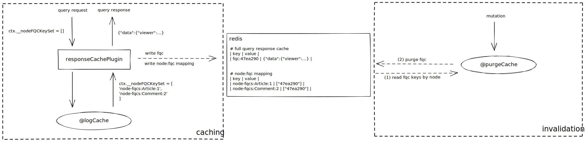

# apollo-response-cache

  [](http://commitizen.github.io/cz-cli/)

Caching and invalidation mechanisms (plugins, directives) of Apollo GraphQL, used by [`matters-server`](https://github.com/thematters/matters-server).

[`responseCachePlugin`](./src/plugins/responseCachePlugin.ts) is forked from [`apollo-server-plugin-response-cache`](https://github.com/apollographql/apollo-server/tree/main/packages/apollo-server-plugin-response-cache).

### How it works?



On each query request,

1. `responseCachePlugin` creates an empty key set, and injects it to the context.
2. `@logCache` collects node on its field, then add to the key set.
3. `responseCachePlugin` writes query response cache (`fqc`) and node-fqc key mapping to in-memory data store.

Once a mutation updates this node, `@purgeCache` will purge related `fqc`.

### Usage

Add plugin and directives to the constructor:

```ts
import {
  responseCachePlugin,
  LogCacheDirective,
  PurgeCacheDirective,
} from '@matters/apollo-response-cache'

const server = new ApolloServer({
  plugins: [responseCachePlugin()],
})

const schema = makeExecutableSchema({
  schemaDirectives: {
    logCache: LogCacheDirective(),
    purgeCache: PurgeCacheDirective(),
  },
})
```

Add definitions to your schema:

```graphql
directive @logCache(
  type: String!
  identifier: String = "id"
) on FIELD_DEFINITION

directive @purgeCache(
  type: String!
  identifier: String = "id"
) on FIELD_DEFINITION
```

Use in the schema:

```graphql
type Query {
  article(id: ID!): Article! @logCache(type: "Article")
}

type Mutation {
  archiveArticle(id: ID!): Article! @purgeCache(type: "Article")
}
```

You can also purge cache in the resolver:

```ts
const resolvers = {
  Mutation: {
    archiveArticle: (parent, args, context) => {
      // ...
      article[CACHE_KEYWORD] = [
        {
          id: article.id,
          type: 'Article',
        },
        {
          id: comment.id,
          type: 'Comment',
        },
      ]

      return article
    },
  },
}
```
